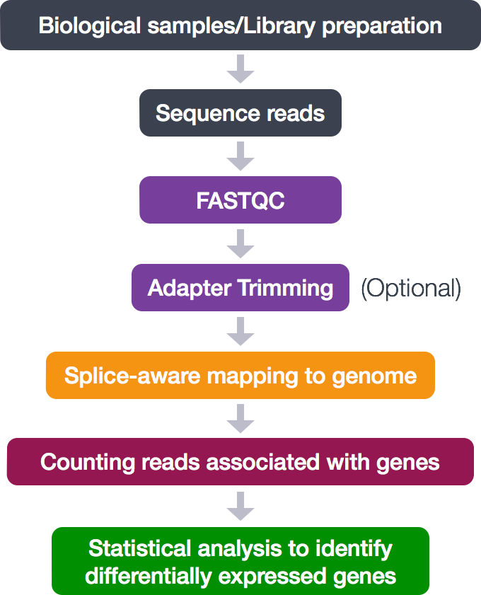

# Basic of RNA-seq analysis

## Environment setup
```
mamba create -n rnaseq python=3.10
```

## Installtion of necessary tools
```
mamba install -c bioconda parallel-fastq-dump -y
mamba install -c bioconda trim-galore -y
mamba install -c bioconda fastqc -y
mamba install -c bioconda hisat2 -y
mamba install -c bioconda samtools -y
mamba install -c bioconda stringtie -y
mamba install -c bioconda bioconductor-deseq2 -y
```

## Reference file preparation
Download all the necessary reference files from NCBI database (takes approximately 20min)
https://www.ncbi.nlm.nih.gov/datasets/genome/GCF_000001405.40/
```
curl -OJX GET "https://api.ncbi.nlm.nih.gov/datasets/v2alpha/genome/accession/GCF_000001405.40/download?include_annotation_type=GENOME_FASTA,GENOME_GFF,RNA_FASTA,CDS_FASTA,PROT_FASTA,SEQUENCE_REPORT&filename=GCF_000001405.40.zip" -H "Accept: application/zip"
unzip GCF_000001405.40.zip "ncbi_dataset/data/GCF_000001405.40/*" -d ref
```

## Genome index file
Indexing genome file for HISAT2
```
mkdir index
hisat2-build -p 20 ref/ncbi_dataset/data/GCF_000001405.40/GCF_000001405.40_GRCh38.p14_genomic.fna index/human_genome
```

## Example fastq files
Download public RNA-seq data  
https://trace.ncbi.nlm.nih.gov/Traces/?view=study&acc=SRP252863  
```
parallel-fastq-dump --sra-id SRR11309003 --threads 4 --outdir fastq --split-files --gzip
parallel-fastq-dump --sra-id SRR11309004 --threads 4 --outdir fastq --split-files --gzip
parallel-fastq-dump --sra-id SRR11309005 --threads 4 --outdir fastq --split-files --gzip
parallel-fastq-dump --sra-id SRR11309006 --threads 4 --outdir fastq --split-files --gzip
```
HEK 293 cell: SRR11309003 SRR11309004  
HBEC 5i cell: SRR11309005 SRR11309006  

## Output directories  
Creation of directories for output data
```
for i in SRR11309003 SRR11309004 SRR11309005 SRR11309006
do
mkdir -p analysis/$i
done
```

## RNA-seq workflow (SRR11309003 as an example)


### Move to the working derectory
```
cd analysis/SRR11309003
```

### Quality chceck
[fastqc](https://www.bioinformatics.babraham.ac.uk/projects/fastqc/)  
```
mkdir qc
fastqc -t 20 -o qc ../../fastq/SRR11309003_1.fastq.gz ../../fastq/SRR11309003_2.fastq.gz
```

### Adaptor trimming
[trim_galore](https://github.com/FelixKrueger/TrimGalore)  
```
mkdir trimmed_fastq
trim_galore -j 20 --paired ../../fastq/SRR11309003_1.fastq.gz ../../fastq/SRR11309003_2.fastq.gz -o trimmed_fastq
```

### Alignment
[HISAT2](https://daehwankimlab.github.io/hisat2/manual/)  
```
hisat2 -p 20 -x ../index/human_genome -1 trimmed_fastq/SRR11309003_1_val_1.fq.gz -2 trimmed_fastq/SRR11309003_2_val_2.fq.gz -S SRR11309003.sam 
```

### SAM and BAM file processing
[samtools](https://www.htslib.org/doc/samtools.html)
```
samtools sort SRR11309003.sam -@ 10 -O bam -o SRR11309003.sort.bam 
samtools index SRR11309003.sort.bam
rm SRR11309003.sam
```

### Read count
[StringTie](https://ccb.jhu.edu/software/stringtie/index.shtml?t=manual)
```
stringtie -p 10 -G ../../ref/ncbi_dataset/data/GCF_000001405.40/genomic.gff -o SRR11309003.count -A  SRR11309003.table SRR11309003.sort.bam
```

### DEG(differentially expressed genes)
DESeq2(R)
```
```

## Overview of the result